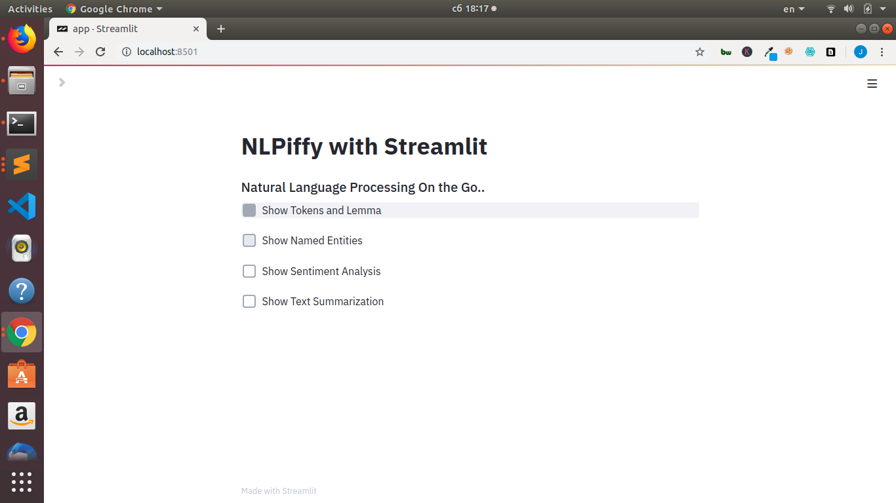
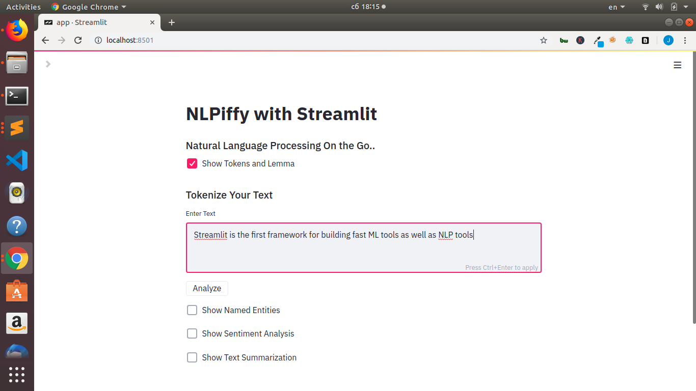
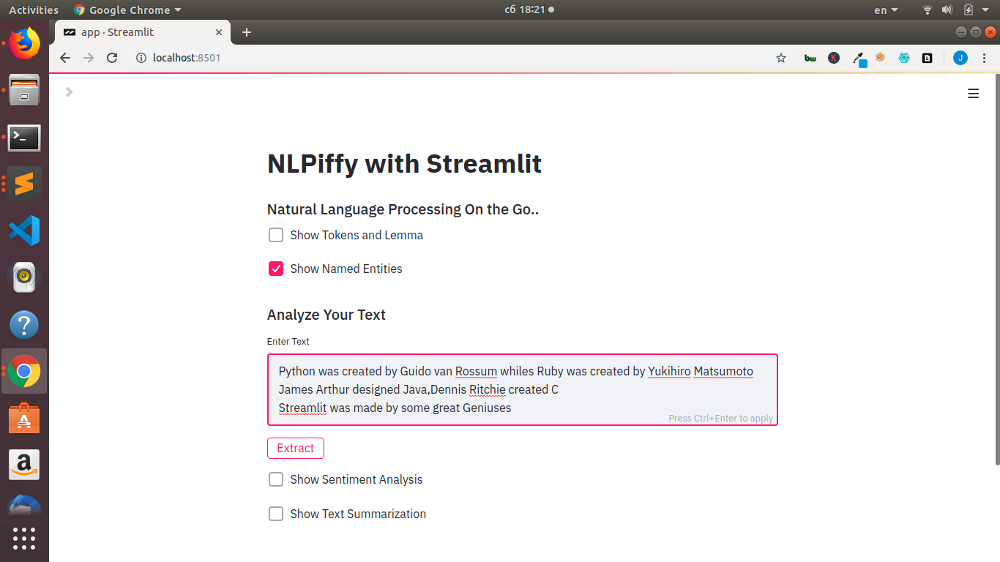
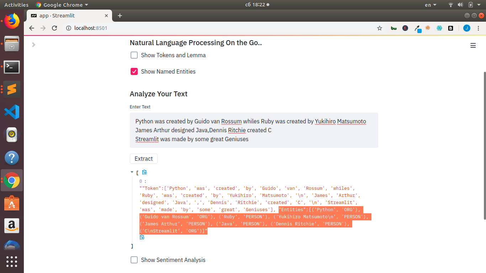
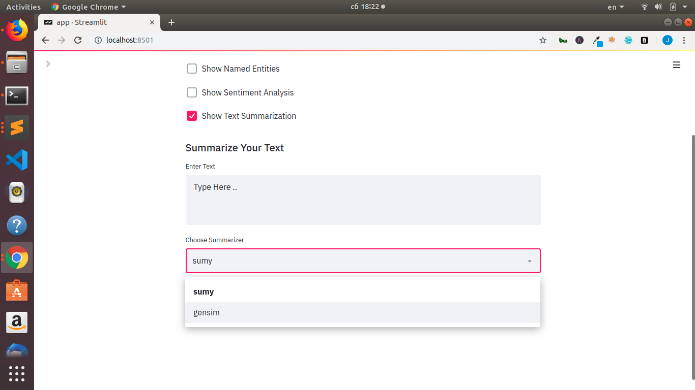

#### Description
This is a Natural Language Processing(NLP) Based App useful for NLP concepts such as follows;
+ Tokenization & Lemmatization using Spacy
+ Named Entity Recognition(NER) using SpaCy
+ Sentiment Analysis using TextBlob
+ Document/Text Summarization using Gensim/Sumy
This is built with Streamlit Framework, an awesome framework for building ML and NLP tools.


#### To Run the App
```bash
streamlit run app.py
```

#### NLP App



#### Tokenization


#### Entity Extraction with Spacy


#### Entity Extraction with Spacy


#### Text Summarization with Sumy/Gensim


